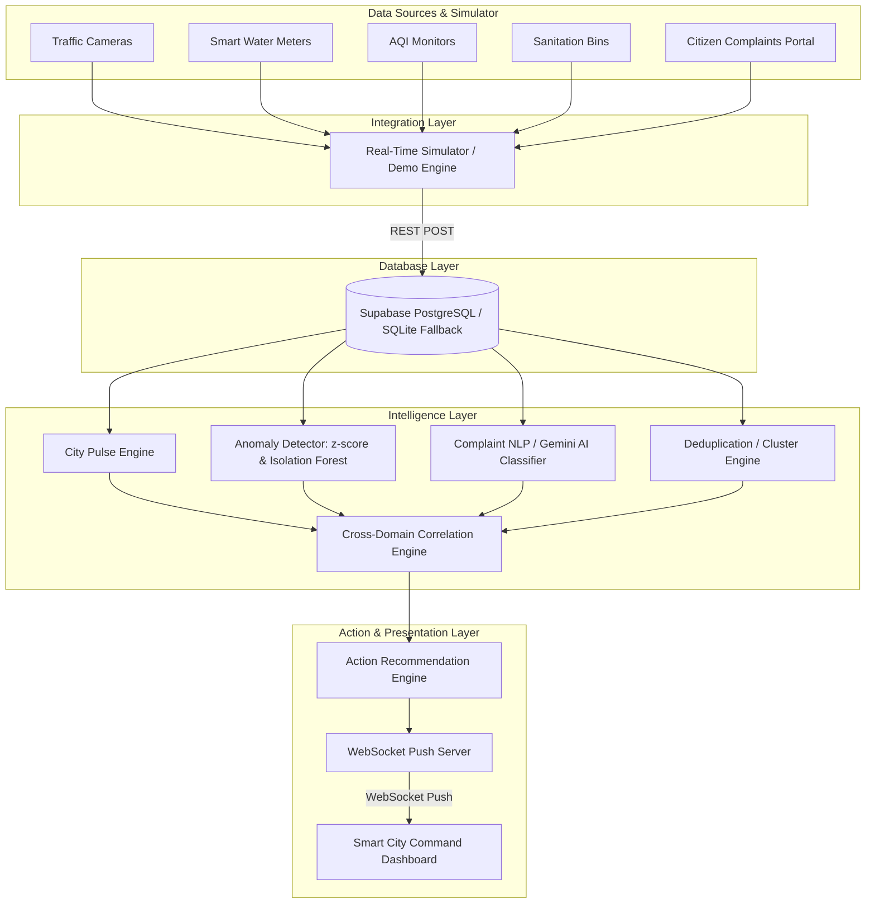

# NavNiti: The AI-Powered Digital Nervous System for Proactive Urban Governance

NavNiti is a next-generation Smart City Command Center Dashboard that unifies fragmented municipal data into a single command center. Rather than simply plotting static analytics, NavNiti acts as a proactive digital nervous system. It ingest simulated real-time data from traffic, water, air quality, sanitation, and citizen complaints; detects anomalies; correlates cross-domain events; predicts risks; and recommends concrete, explainable actions to city administrators.

---

## 1. Problem
Modern smart cities are overwhelmed by fragmented, siloed data. Traffic cameras, smart water meters, air monitors, sanitation sensors, and citizen complaints are managed in isolated departments. 
- **The Consequence**: When a water main bursts, or gridlock spikes toxic emissions, administrators only find out after hours of delay and separate complaints.
- **The Gap**: Traditional dashboards tell administrators *WHAT* happened, but fail to explain *WHY* it happened, *WHAT* may happen next, and *WHAT* actions should be taken immediately.

## 2. Solution
**NavNiti** bridges this gap by introducing an active command center that:
1. **Unifies Telemetry**: Visualizes traffic congestion, AQI levels, sanitation bin status, water pipeline metrics, and citizen complaints by city ward in real time.
2. **Calculates City Health**: Computes a dynamic **City Pulse Score** (0-100) for every ward using weighted scoring.
3. **Applies Anomaly Detection**: Uses statistical z-scores and multidimensional **Isolation Forests** to detect water pipe leaks, traffic jams, and sanitation overflow points before they become critical.
4. **Correlates Cross-Domain Events**: Combines telemetry and citizen reports to detect compound incidents (e.g., Traffic Congestion causing localized AQI spikes, or Water pressure collapse indicating pipe burst).
5. **Recommends Explainable Action Checklists**: Uses NLP/Generative AI to categorize citizen reports, group duplicate complaints into "Incident Clusters," and provide step-by-step recommended checklists.

---

## 3. System Architecture



---

## 4. Features & Tech Stack

### Tech Stack
- **Frontend**: React (Vite) + Tailwind CSS + Recharts (Charts) + Leaflet / React-Leaflet (OSM mapping) + Lucide Icons + Canvas-Confetti.
- **Backend**: Python + FastAPI (with WebSocket support) + SQLAlchemy ORM.
- **Database**: Supabase (PostgreSQL) with local SQLite fallback (zero-dependency local development).
- **AI/ML**: Google Gemini API integration (with local keywords/NLP fallback), Scikit-Learn (Isolation Forest), and custom statistical z-score engines.

### Key Data Models
1. **Ward**: `id`, `name`, `latitude`, `longitude`, `population`, `baseline_pulse_score`
2. **TrafficReading**: `ward_id`, `timestamp`, `vehicle_count`, `congestion_percentage`, `average_speed`
3. **WaterReading**: `ward_id`, `timestamp`, `pressure`, `flow_rate`, `consumption`
4. **AirQualityReading**: `ward_id`, `timestamp`, `aqi`, `pm25`, `pm10`
5. **SanitationReading**: `ward_id`, `timestamp`, `garbage_fill_percentage`, `collection_status`
6. **CitizenComplaint**: `id`, `ward_id`, `timestamp`, `raw_text`, `category`, `severity`, `status`, `latitude`, `longitude`, `duplicate_group_id`, `ai_summary`
7. **Alert**: `id`, `ward_id`, `timestamp`, `type`, `severity`, `title`, `description`, `confidence`, `contributing_factors` (JSON list), `recommended_actions` (JSON list), `status`

---

## 5. Intelligence Layer Algorithms

### Dynamic City Pulse Score (0-100)
- **Weights**: Traffic 25% | Air Quality 25% | Water 20% | Sanitation 15% | Citizen Complaints 15%
- **Formula**: Calculated and normalized in real-time as new metrics arrive.
- **Trend Explanation**: Dynamically compares the latest ward score with a 30-minute historical average to output descriptive tooltips (e.g. *"Pulse score decreased 22.5 points primarily due to traffic congestion"*).

### Anomaly Detection
1. **Statistical Outliers**: Monitors rolling averages and flags z-scores exceeding standard dev thresholds ($\pm 2.5$).
2. **Multidimensional Isolation Forest**: Trains an `IsolationForest` model on the combined vectors of the 5 sensor types to detect complex multi-metric anomalies.

### Complaint NLP & Deduplication (Clustering)
- **Gemini NLP Classifier**: Parses text to extract the Category, Severity, and a 1-sentence AI Summary.
- **Deduplication Engine**: Uses character SequenceMatcher and Jaccard word-level similarity to group complaints submitted in the same ward. If a duplicate is detected, it is marked as `duplicate` and linked to the same `duplicate_group_id` (Incident Cluster) to prevent dashboard clutter.

### Cross-Domain Correlation Engine
- **Traffic + AQI**: Triggered if Traffic Congestion is high ($\ge 80\%$), AQI is high ($\ge 180$), and $\ge 2$ citizen reports match.
- **Water Pipeline Burst**: Triggered if Water Pressure collapses ($\le 45$ PSI), Flow Rate spikes ($\ge 32$ L/s), and $\ge 2$ water complaints appear.

---

## 6. Installation & Configuration

### Prerequisites
- Node.js (v18+)
- Python (v3.10+)

### Setup Environment Variables
Create a `.env` file inside the `backend` directory (copying from `backend/.env.example`):
```ini
# Port for FastAPI server
PORT=8000

# Database Configuration (Supabase PostgreSQL Connection String)
# If left empty, the backend automatically falls back to local SQLite (backend/navniti.db)
DATABASE_URL=your_supabase_postgresql_connection_string

# Gemini API Key (Optional)
# If left empty, local keyword/NLP heuristics are used
GEMINI_API_KEY=your_gemini_api_key
```

### Installation Steps

1. **Clone and Setup Backend**:
   ```bash
   cd backend
   python -m venv venv
   # Windows PowerShell:
   .\venv\Scripts\Activate.ps1
   # Linux/macOS:
   source venv/bin/activate
   
   pip install -r requirements.txt
   python database.py             # Initializes database tables and seeds 10 Nagpur wards
   ```

2. **Setup Frontend**:
   ```bash
   cd ../frontend
   npm install --legacy-peer-deps  # Installs React, Leaflet, Recharts, Lucide
   ```

---

## 7. Running Locally

You need to run the **Backend API**, the **Real-time Simulator**, and the **Vite React Dev Server** in separate terminals.

**Terminal 1 — FastAPI Server**:
```bash
cd backend
# Activate virtual environment
.\venv\Scripts\Activate.ps1
# Start server
uvicorn main:app --reload --port 8000
```
API Documentation will be available at http://localhost:8000/docs.

**Terminal 2 — Real-time Simulator**:
```bash
cd backend
# Activate virtual environment
.\venv\Scripts\Activate.ps1
# Start simulator
python simulator.py
```

**Terminal 3 — Frontend Dashboard**:
```bash
cd frontend
npm run dev
```
Open http://localhost:5173 in your browser to view the Command Center!

---

## 8. Live Hackathon Demonstration Flow (3-5 Minutes)

Use the **Demo Scenario Controller** at the top of the dashboard to trigger incidents deterministically:

### Step 1: Establish Healthy Baseline (City Pulse ~90)
1. Select **Normal City** scenario.
2. Show the **Interactive Ward Map** — all hexagons are green/blue (healthy).
3. Demonstrate the **City Pulse Cards** and dynamic trend line updating every 4 seconds.
4. Click on any ward (e.g. Ward 3) to show the **Focused Inspector** displaying healthy sub-metrics (Traffic, Water, Air, Sanitation, Citizens).

### Step 2: Trigger Traffic + AQI Incident (Ward 7)
1. Click **Traffic + AQI** on the Demo Controller.
2. **Watch the telemetry deteriorate**:
   - Ward 7's traffic congestion climbs from 45% to over 90% (observe values and bar charts).
   - Local AQI spikes to 230+, and PM2.5 rises.
3. **Observe complaints injection**: Look at the right panel, three citizens complaints automatically submit: *"Traffic is at a standstill... exhaust smoke making it hard to breathe."*
4. **Trigger Alert & Explainable AI**:
   - A high-severity alert pops up: **CROSS-DOMAIN TRAFFIC-AIR QUALITY INCIDENT**.
   - Click the alert card: Explain to the judges the **Why? (Explainable AI)** section showing the contributing factors (90% congestion, 230 AQI, and citizen complaints).
   - Show the recommended checklist: deploy traffic unit, diversion, monitor AQI. Click **Deploy** to show interactive resolution.

### Step 3: Trigger Water Pipeline Rupture (Ward 4)
1. Click **Pipeline Leak** on the Demo Controller.
2. **Watch telemetry collapse**:
   - Ward 4 water pressure drops from 80 PSI down to 35 PSI.
   - Flow rate spikes (water escaping the pipe), while consumption drops.
3. **Observe duplicate clustering**:
   - Three complaints are posted: *"Water pressure is low... bare supply... no water since morning."*
   - Highlight that instead of cluttering the board as 3 reports, they are grouped into a single **Incident Cluster** (Deduplicated banner).
4. **View Critical Alert**:
   - A critical alert triggers: **POTENTIAL WATER PIPELINE FAILURE**.
   - Click it: Explain the contributing factors (decrease in pressure, flow patterns, and complaints).
   - Dispatch the maintenance team to *Pipeline Zone B*.

### Step 4: Resolve to Normal
1. Click **Normal City**.
2. Confetti triggers! Wards return to green/blue health, confirming proactive resolution.
